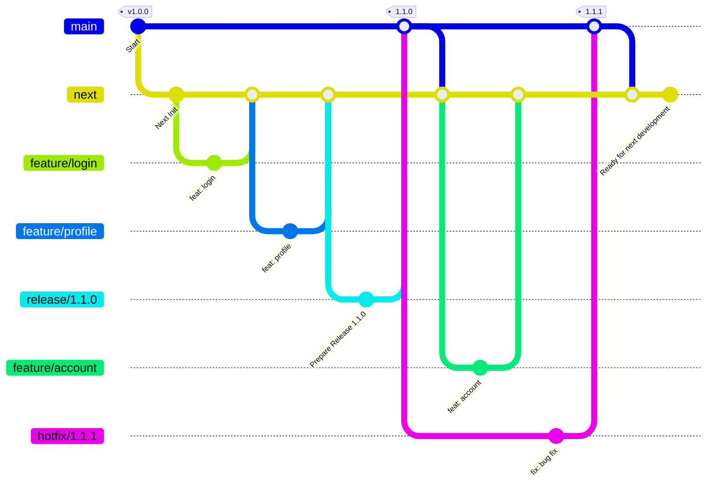
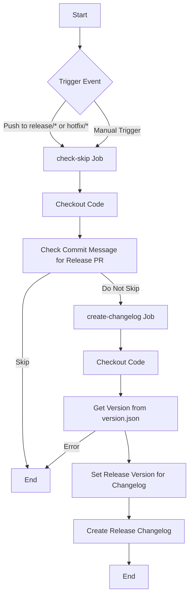
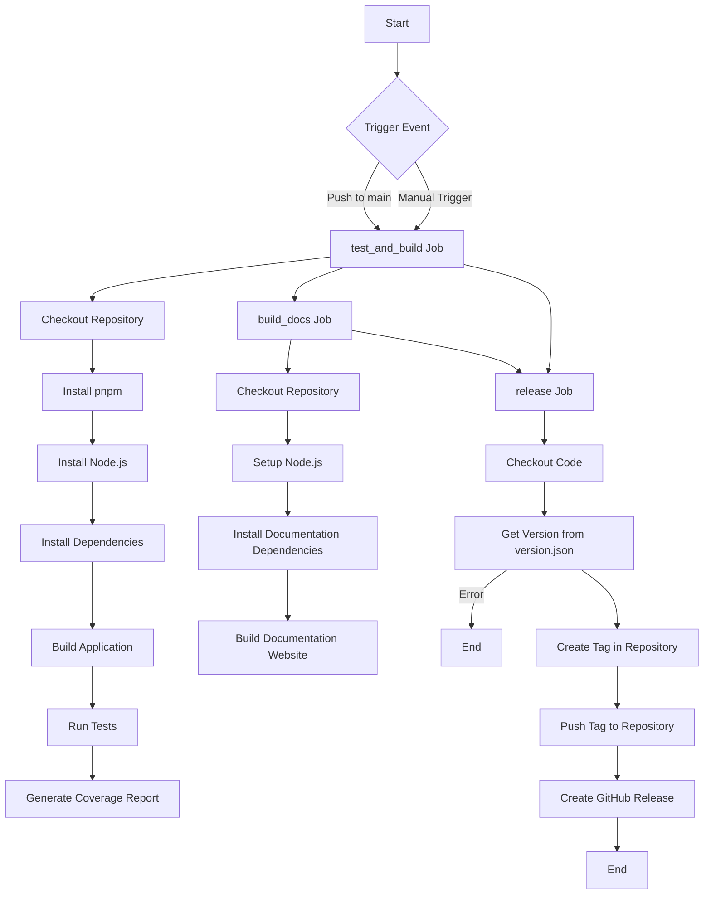
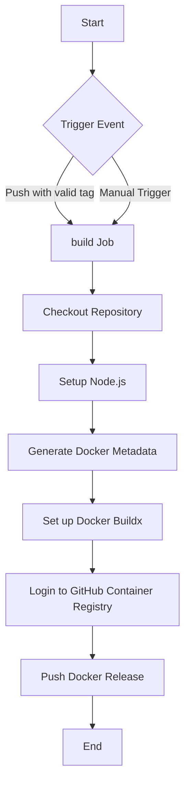

# Release Management Guide

This document outlines the release management strategy for the repository. It serves as a comprehensive guide to ensure a clear and standardized approach for the team and maintainers.

---

## Table of Contents

1. [Release Overview](#release-overview)
2. [Release Strategy](#release-strategy)
3. [Versioning Strategy](#versioning-strategy)
4. [Version And Dependencies Management](#version-and-dependencies-management)
5. [Release Workflow](#release-workflow)
6. [Git Workflow](#git-workflow)
7. [Pipelines](#pipelines)

---

## Release Overview

The release management process is essential for maintaining a stable and reliable codebase. It involves several key steps to ensure that new features and bug fixes are properly planned, developed, tested, and released for a new version. The process includes:

1. **Planning**: Define the roadmap and prioritize features and bug fixes for the next release.
2. **Development**: Implement the planned features and fixes in `feature/*` branches, which are then merged into the `next` branch.
3. **Testing**: Run unit, integration, and end-to-end tests to ensure the code is stable and meets quality standards.
4. **Documentation**: Update relevant documentation, including API docs, user guides, and the changelog.
5. **Release Preparation**: Create a `release/*` branch from the `next` branch, finalize release-specific changes, and update version numbers.
6. **Release**: Merge the `release/*` branch into the `main` branch, tag the release.
7. **Post-Release**: Merge the `main` branch back into the `next` branch to synchronize changes and notify stakeholders about the release.

This structured approach ensures that each release is well-documented, tested, and aligned with the versioning strategy, providing a clear and standardized process for the team and maintainers.

---

## Release Strategy

The release strategy will apply the release batching style, where multiple features and bug fixes are bundled together and released at once. This approach helps to reduce the overhead of managing multiple releases and ensures that the codebase is stable before each release. The maintainers will follow a structured release process to ensure that each release is well-documented, tested, and aligned with the versioning strategy.

- The team/maintainers need to define the roadmap and prioritize the features.
- Based on the roadmap, the team/maintainers will plan the features and bug fixes to be included in the next release.

---

## Versioning Strategy

We follow Semantic Versioning (SemVer) for our version strategy, which uses the format **MAJOR.MINOR.PATCH**:

- **MAJOR** version increments when making incompatible changes.
- **MINOR** version increments when adding functionality in a backward-compatible manner.
- **PATCH** version increments when making backward-compatible bug fixes.

Additional labels for pre-release and build metadata are available as extensions to the **MAJOR.MINOR.PATCH** format. [Reference link](https://semver.org/#semantic-versioning-specification-semver)
**Example**: 1.0.0-alpha < 1.0.0-alpha.1 < 1.0.0-alpha.beta < 1.0.0-beta < 1.0.0-beta.2 < 1.0.0-beta.11 < 1.0.0-rc.1 < 1.0.0.

### API Version to Repository Version

#### PATCH Changes:

When the patch version of the API is incremented, the patch version of the repository must also be incremented.
This reflects backward-compatible fixes or updates that do not alter the API's core functionality.

#### MINOR Changes:

When the minor version of the API is incremented, the minor version of the repository must also be incremented.
Releases with non-breaking additions or enhancements must also update the API Swagger documentation to reflect the changes.
Ensure that the repository and API documentation updates are released together to maintain alignment.

#### MAJOR Changes:

When the major version of the API is incremented, the major version of the repository must also be incremented.
Breaking changes in the API require corresponding updates to the API Swagger documentation.
Repository updates and API documentation updates must be released simultaneously to prevent inconsistencies.

#### Key Principles

- Maintain consistency between the API version and repository versioning to avoid confusion.
- Always include updated Swagger or OpenAPI documentation with every release, ensuring developers have accurate information.
- Testing and validation are mandatory for every version increment to guarantee compatibility and reliability.

### Documentation Versioning

**MAJOR** version will be changed when the code version is changed.

**MINOR** version will be changed when the documentation is updated. In some cases, the documentation is not updated, but the code is updated. For example, when a new feature like management of a new type of resource is added, the documentation is not updated, but the code is updated.

**PATCH** version will be changed when the documentation is updated. It does not mean the code version is updated.

---

## Version And Dependencies Management

### Overview

The version.json file serves as a central metadata file to define the versioning and dependencies of a service. It ensures compatibility checks can be automated in CI/CD pipelines and provides clear documentation for integrators about which service versions work together.

### Example Structure

```
// version.json
{
  "version": "1.0.0",
  "apiVersion": "1.0.0",
  "docVersion": "1.0.0",
  "dependencies": {
    // Example dependency service
    "dependency-service": {
      "repoUrl": "https://github.com/repo/dependency-service.git",
      "versions": ["1.0.0", "1.0.1", "1.0.2"]
    }
  }
}
```

### Key Fields

- version: The version of the current service. Must align with the Git tag.
- apiVersion: The API version exposed by the service, the field is optional.
- docVersion: The version of the documentation.
- dependencies: A list of dependent services with their repositories and compatible version list, the field is optional.
- repoUrl: URL of the repository for the dependent service.
- versions: Specifies compatible versions.

---

## Release Workflow

**1. Pre-Release Steps**

1. Verify all feature branches have been merged into the next branch. The merged features must include all relevant unit tests, integration tests, end-to-end tests, and comprehensive documentation.
2. Create a `release/*` branch from the next branch.
   - Special Case: For cherry-picking specific commits, create the branch from the last release commit on `next` and cherry-pick the required commits from `next`.
3. Update version numbers in package.json and version.json as per Versioning Strategy.
4. Run tests (unit, integration, and end-to-end) and ensure they all pass.
5. Update documentation (e.g., Swagger, README, or user guides).
6. Generate the documentation for the new version using the release script:
   ```bash
   # Run the release script
   pnpm release:doc
   ```
7. Merge the changelog PR automatically generated by the changelog pipeline.

**2. Release Steps**

1. Create a PR for the `release/*` branch to the main branch.
2. Get approval from the team.
   - The PR must pass all automated tests and have no conflicts.
   - The PR must include the migration guide if there are any breaking changes.
3. Merge the `release/*` branch into main.
4. Automatically tag will be created for the release by release pipeline.
5. Automatically build the docker image and push it to the registry by the package pipeline.

**3. Post-Release Steps**

1. Merge the main branch into the next branch to synchronize changes.
2. Notify relevant stakeholders about the release.

**4. Hotfix Workflow**
For critical bugs, follow the Hotfix Release process.

1. Create a `hotfix/*` branch from the main branch.
2. Make the necessary changes and update the version number.
3. Create a PR for the `hotfix/*` branch to the main branch.
4. Get approval from the team.
   - The PR description must include the acceptance criteria checklist from the issue ticket.
   - The reviewer must ensure that the acceptance criteria are met before approving the PR.
   - The PR must pass all automated tests and have no conflicts.
5. Merge the PR to the main branch.
6. Merge the main branch into the next branch.

---

## Git Workflow

### Development and Feature Branches

1. All feature development occurs in `feature/*` branches branched from the `next` branch.
2. Features are merged back into the `next` branch upon completion and successful review.

### Release Branches

1. Create a `release/*` branch from the `next` branch to prepare for a new version.

- In some special cases, the release wants to cherry-pick some features from the `next` branch to the `release/*` branch. So, the `release/*` branch needs to be created from the commit that is the previous release merged commit from `main` branch to `next` branch, and then cherry-pick the features from the `next` branch to the `release/*` branch.

2. Use this branch to finalize release-specific changes such as version bumping and documentation updates.
3. Merge the `release/*` branch into the `main` branch to release.
4. Tag the merge commit on `main` with the release version (e.g., `1.1.0`).
5. Merge the `main` branch back into the `next` branch to ensure the `next` branch reflects the latest state of `main`.

### Hotfix Branches

1. In the event of a critical issue, create a `hotfix/*` branch from the `main` branch.
2. Make and commit the necessary changes.
3. Merge the `hotfix/*` branch into the `main` branch and tag the commit (e.g., `1.1.1`).
4. Merge the `main` branch back into the `next` branch to keep both branches synchronized.

### Example Workflow



---

## Pipelines

### Changelog Pipeline

The changelog pipeline automatically generates a changelog based on the commit messages on the `release/*` branch or the `hotfix/*` branch.
The changelog generation is initiated by the `create-changelog` job in the pipeline.



### Release Pipeline

The release pipeline will automatically tag the release version when the `release/*` branch or `hotfix/*` is merged into the `main` branch. The release pipeline will run the unit test and build the application to ensure the code is stable before releasing.
The release is initiated by the `release` job in the pipeline.



### Package Pipeline

The package pipeline will automatically build the docker image and push it to the registry when existing the new tag in the repository.
The package pipeline is initiated by the `package` job in the pipeline.



---
